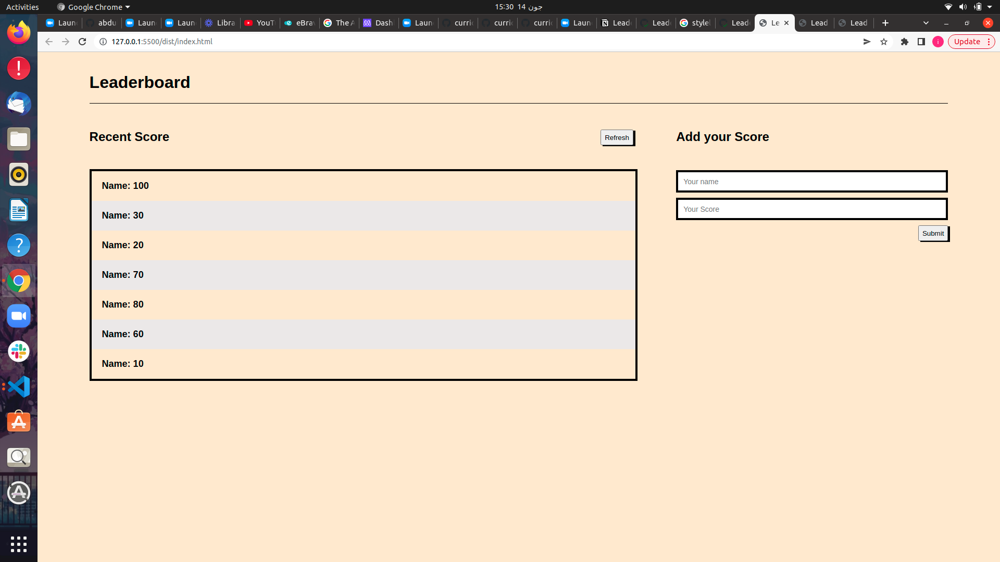

## leaderboard-es6


JavaScript project for the Leaderboard list app, built using webpack and ES6 features. The leaderboard website displays scores submitted by different players. It also allows you to submit your score. All data is preserved using the external Leaderboard API service.



## Built With

- Webpack
- HTML
- CSS
- Modular JavaScript (with modern ES6 syntax)

## Live Demo

N/A

## Getting Started

**Setup**

git clone https://github.com/ibrahim777764/leaderboard-es6.git
```
cd leaderboard
npm install
npm start
```

**Deploy**
```
npm run build
npm run deploy

```

## 👤 Author


- GitHub: [@ibrahim777764](https://github.com/ibrahim777764)

## 🤝 Contributing

Contributions, issues, and feature requests are welcome!


## Show your support

Give a ⭐️ if you like this project!

## 📝 License

This project is [MIT](./MIT.md) licensed.
